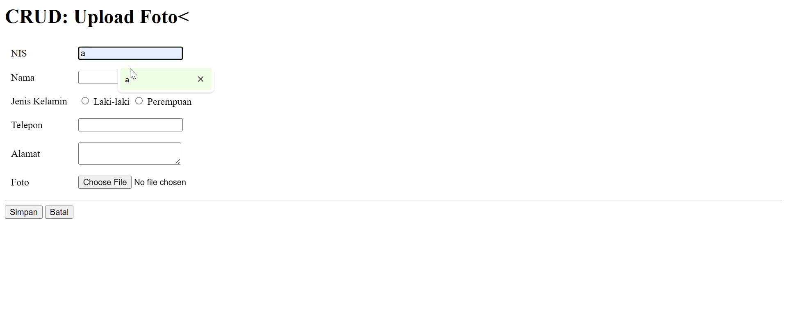

| Name           | NRP        | Kelas     |
| ---            | ---        | ----------|
| Fathiya Nayla Husna Wibowo | 5025241204 | B |

# Minggu 12: Arsitektur Aplikasi Web
## Penjelasan Latihan
### **1. STUDI KASUS: Aplikasi Manajemen Data Siswa**
#### Aplikasi Manajemen Data Siswa Berbasis Web (CRUD + Upload Foto)
Teknologi:
- Front-End: HTML, CSS, JavaScript (Fetch API)
- Back-End: PHP Native
- Database: MySQL
- Arsitektur: Three-Tier (Presentation – Logic – Data Layer)

#### Deskripsi Singkat
Aplikasi ini digunakan untuk mengelola data siswa, meliputi:
- Input data siswa baru
- Menampilkan daftar siswa
- Update data siswa
- Hapus data siswa
- Upload foto profil siswa

## Dokumentasi

